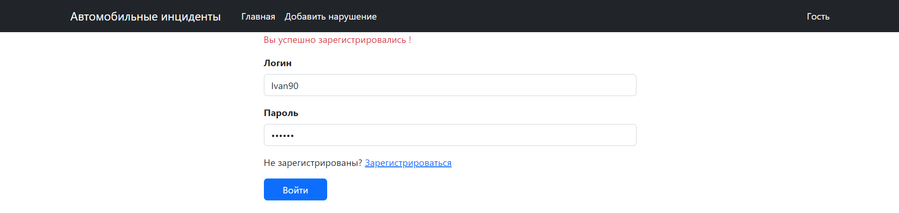

## Автонарушители
Пользователи добавляют автонарушение. Указывая название, адрес, описание нарушения, статьи, категорию.

### Стек технологий:


### Требования к окружению :

- 
- 
- 

### Запуск приложения

Запуск с помощью командной строки:

1. Создать базу данных cars.

```CREATE DATABASE auto_crash;```

2. Перейти в папку с проектом.
3. Выполнить команду: mvn liquibase:update
4. Выполнить команду: mvn clean install
5. Выполнить команду: mvn spring-boot:run
6. Перейти по ссылке: http://localhost:8080

### Виды

#### Вид входа


#### Вид регистрации


#### Вид добавления инцидента


#### Вид редактирования инцидента


#### Главный вид


### Расширения приложения

Реализовать статусы заявок, добавить возможность добавления фотографии.

### Контакты: @WhiteVax